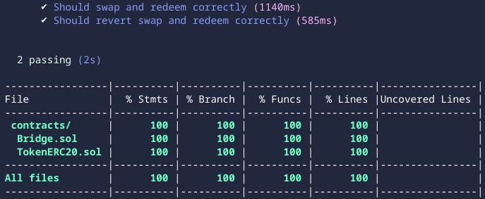

# CROSS-CHAIN BRIDGES

- a bridge contract for `ERC-20` token transfers between `Ethereum` and `Binance Smart chain`

- `Swap()`: transfers tokens from sender to the contract and emits event `swapInitialized`.
- `Redeem()`: takes hashed message and a signature, calls ecrecover to recover the signer and verifies if the recovered address is the validator address; if yes, transfers tokens to the receiver.

- `ERC-20-Token` Deployed and Verified on [goerli](https://goerli.etherscan.io/address/0xc1c13750cFC5f3C1E5A894543FC56e2aB8cbDd4e#code)
- `ERC-20-Token` Deployed and Verified on [bsc-testnet](https://testnet.bscscan.com/address/0xc1c13750cFC5f3C1E5A894543FC56e2aB8cbDd4e#code)

- `Bridge` Deployed and Verified on [goerli](https://goerli.etherscan.io/address/0x04792d2f0533Aa944A611190e01Da756806550b2#code)
- `Bridge` Deployed and Verified on [bsc-testnet](https://testnet.bscscan.com/address/0x04792d2f0533Aa944A611190e01Da756806550b2#code)

- with [owner-goerli](https://goerli.etherscan.io/address/0x1f190F523deBD185183d8Afe76e4587a08bb84e7)
- with [owner-bsc-testnet](https://testnet.bscscan.com/address/0x1f190f523debd185183d8afe76e4587a08bb84e7)

## hardhat tasks:

- `npm install hardhat`
- `npx hardhat coverage`
- `npx hardhat run --network goerli scripts/deployToken.ts`
- `npx hardhat verify --network goerli 0xc1c13750cFC5f3C1E5A894543FC56e2aB8cbDd4e "TokenERC20" "TKN"`
- `npx hardhat run --network bsctestnet scripts/deployToken.ts`
- `npx hardhat verify --network bsctestnet 0xc1c13750cFC5f3C1E5A894543FC56e2aB8cbDd4e "TokenERC20" "TKN"`
- `npx hardhat run --network bsctestnet scripts/deployBridgeBSC.ts`
- `npx hardhat verify --network bsctestnet 0x04792d2f0533Aa944A611190e01Da756806550b2 "0x1f190F523deBD185183d8Afe76e4587a08bb84e7" "0xc1c13750cFC5f3C1E5A894543FC56e2aB8cbDd4e" 5`
- `npx hardhat run --network goerli scripts/deployBridgeETH.ts`
- `npx hardhat verify --network goerli 0x04792d2f0533Aa944A611190e01Da756806550b2 "0x1f190F523deBD185183d8Afe76e4587a08bb84e7" "0xc1c13750cFC5f3C1E5A894543FC56e2aB8cbDd4e" 97`

## coverage

 

</a>

 
